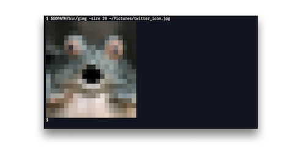

# gimg
Printing image in terminal by ANSI/VT100 Control sequences

# Install

```
$ git clone git@github.com:Lewuathe/gimg.git
$ go install github.com/Lewuathe/gimg
```

# Usage

```
$ $GOPATH/bin/gimg someimage.jpg
```

Will print the image in your terminal with resizing.



# License

[MIT License](https://opensource.org/licenses/MIT)